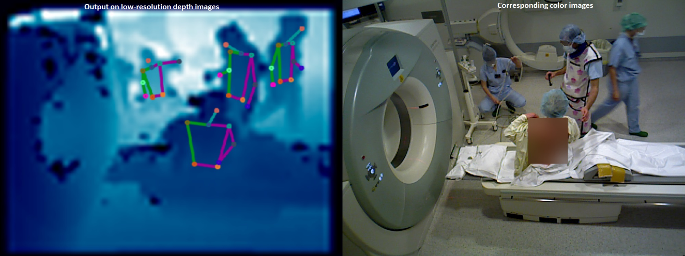
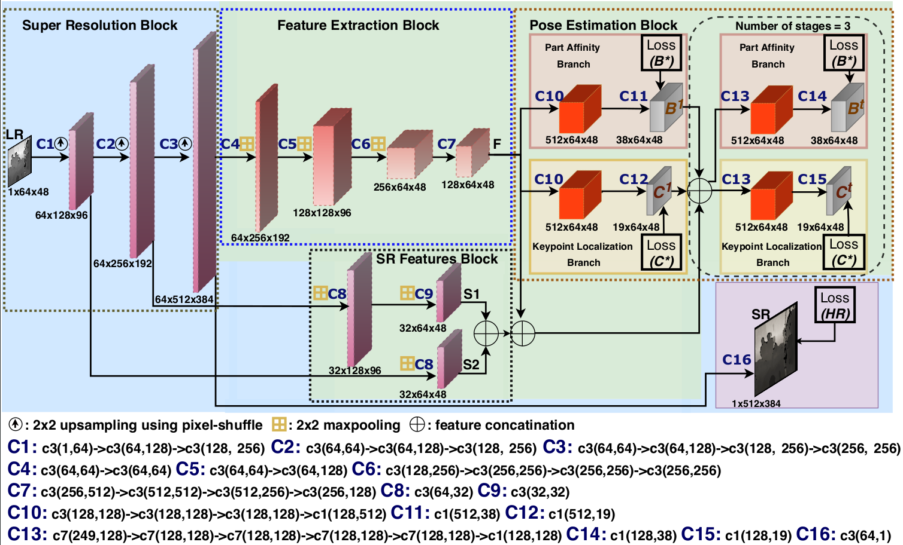

<div align="center">
<a href="http://camma.u-strasbg.fr/">

</a>
</div>


# ORPose-Depth
**Human Pose Estimation on Privacy-Preserving Low-Resolution Depth Images (MICCAI-2019)**

_Vinkle Srivastav, Afshin Gangi, Nicolas Padoy_

This repository contains the inference demo and evaluation scripts.

[](https://arxiv.org/abs/2007.08340) [](https://colab.research.google.com/github/CAMMA-public/ORPose-Depth/blob/master/orpose_depth_demo.ipynb)

<br/>

<p float="center">  </p>
<p float="center">  </p>

# Introduction
<div style="text-align: justify"> 
We propose a multi-person HPE architecture specifically designed for low-resolution depth images. The main motivation to use the low-resolution depth images is to preserve the privacy of patients and clinicians. We extend the multi-person pose architecture (<b>RTPose</b>) with super-resolution architecture. The super-resolution architecture generates the intermediate feature maps containing the high-frequency details, which are lost during the low-resolution image generation process. These intermediate feature maps are exploited in the pose estimation architecture for better localization. Our proposed integrated architecture namely <b>DepthPose</b> is shown below. We train the joint architecture in an end-to-end manner where the pose estimation block is trained using the heatmap and part affinity loss and a super-resolution block is trained using the L2 reconstruction loss w.r.t high-resolution depth image. Our evaluation on the <b>MVOR dataset</b> shows that even with a 10x subsampling of the depth images, our method achieves results equivalent to a pose estimator trained and tested on the original-size images.
</div>
<p float="center">  </p>

# Getting Started


## Installation
You need to have a [Anaconda3](https://www.anaconda.com/products/individual#linux) installed for the setup
```sh
> sudo apt-get install ffmpeg 
> ORPose_Depth=/path/to/ORPose_Depth/repository
> git clone https://github.com/CAMMA-public/ORPose-Depth.git $ORPose_Depth
> cd $ORPose_Depth
> conda create -n orposedepth_env python=3.7
> conda activate orposedepth_env
# install dependencies
# install lateset version of pytorch or choose depending on your cuda environment (needs pytorch > 1.0)
(orposedepth_env)> conda install pytorch torchvision cudatoolkit=10.2 -c pytorch 
(orposedepth_env)> conda install -c conda-forge scipy tqdm yacs pycocotools opencv
(orposedepth_env)> conda install jupyterlab
(orposedepth_env)> cd lib && make && cd ..
# download the low resolution images and models
(orposedepth_env)> wget https://s3.unistra.fr/camma_public/github/DepthPose/models.zip
(orposedepth_env)> wget https://s3.unistra.fr/camma_public/github/DepthPose/data.zip
(orposedepth_env)> unzip models.zip
(orposedepth_env)> unzip data.zip
(orposedepth_env)> rm models.zip data.zip
```
## Evaluation on the MVOR dataset
**We are providing the following models for the evaluation and demo : DepthPose_80x60 and DepthPose_64x48**
```sh
(orposedepth_env)> cd $ORPose_Depth
# --use-cpu  flag to run the evaluation on the cpu
# To run the evaluation for DepthPose_64x48 model
(orposedepth_env)> python tools/eval_mvor.py --config_file experiments/mvor/DepthPose_64x48.yaml
# To run the evaluation for DepthPose_80x60 model
(orposedepth_env)> python tools/eval_mvor.py --config_file experiments/mvor/DepthPose_80x60.yaml
# or run the script
(orposedepth_env)> cd run && bash eval_depthpose_mvor.sh
```
**You should see the following results after the evaluation**

|  **Model** 	      |  Head 	| Shoulder | Hip  	|  Elbow 	| Wrist | **Average** |
|------------------	|-------- |--------- |------	|-------	|-------|-------------|
| DepthPose_80x60  	| 84.3  	|  83.8 	 |  55.3 	| 69.9 	  | 43.3  |    **67.3** |
| DepthPose_64x48  	| 84.1  	|  83.4  	 |  54.3 	| 69.0 	  | 41.4  |    **66.5** |


## Demo on the local computer
```sh
# open the 'orpose_depth_demo.ipynb' notebook file in jupyter lab 
(orposedepth_env)> jupyter lab 
```
## Demo on the Google Colab
If you do not have a suitable environment to run the code, then you can also run the evaluation and demo code on the Google Colab.

**Try our Colab demo using the notebook we have prepared**

[](https://colab.research.google.com/github/CAMMA-public/ORPose-Depth/blob/master/orpose_depth_demo.ipynb)

# Citation
```bibtex
@inproceedings{srivastav2019human,
  title={Human Pose Estimation on Privacy-Preserving Low-Resolution Depth Images},
  author={Srivastav, Vinkle and Gangi, Afshin and Padoy, Nicolas},
  booktitle={International Conference on Medical Image Computing and Computer-Assisted Intervention},
  pages={583--591},
  year={2019},
  organization={Springer}
}
@inproceedings{cao2017realtime,
title = {Realtime Multi-Person 2D Pose Estimation using Part Affinity Fields},
author = {Zhe Cao and Tomas Simon and Shih-En Wei and Yaser Sheikh},
booktitle = {The IEEE Conference on Computer Vision and Pattern Recognition (CVPR)},
year = {2017}
}
```

# License
This code, models, and datasets are available for non-commercial scientific research purposes as defined in the [CC BY-NC-SA 4.0](https://creativecommons.org/licenses/by-nc-sa/4.0/). By downloading and using this code you agree to the terms in the [LICENSE](LICENSE). Third-party codes are subject to their respective licenses.


# References
 - Bipartite graph matching code for keypoint-to-person identification is borrowed from [PyTorch_RTPose](https://github.com/tensorboy/pytorch_Realtime_Multi-Person_Pose_Estimation).
 - Evaluation code is from [MVOR](https://github.com/CAMMA-public/MVOR)
